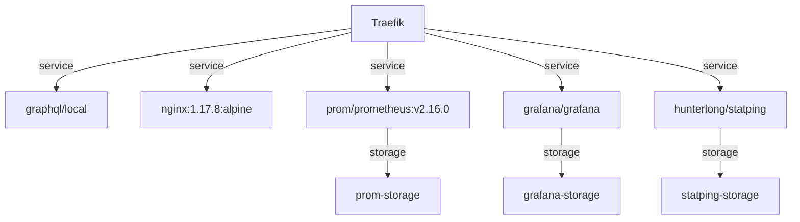

# tccauley.dev

### Current Container Infrastructure

#

#### Progress Report:

-   [x] Traefik reverse-proxy, load balancer - [x] Enable Dashboard/API - [x] Enable Prometheus@internal
-   [x] Nginx - [ ] Maaaaybe reverse proxy for React frontend?
-   [x] Prometheus - [x] Storage - [x] /metrics endpoint
-   [x] Grafana - [x] Monitor Traefik
-   [x] Statping - [ ] Style status page - [ ] Configure alerts
-   [x] GraphQL - [x] Builder custom Docker image - [x] Install npm/nodejs - [x] Install instantclient19.3-basic - [x] Add server.js/package.json - [x] Setup Oracle wallet - [x] Get node-oracledb to talk to Oracle ATP - [ ] Get GraphQL to query Oracle ATP via node-oracledb
-   [ ] Jaeger - [ ] Storage - [ ] Track API calls

#
